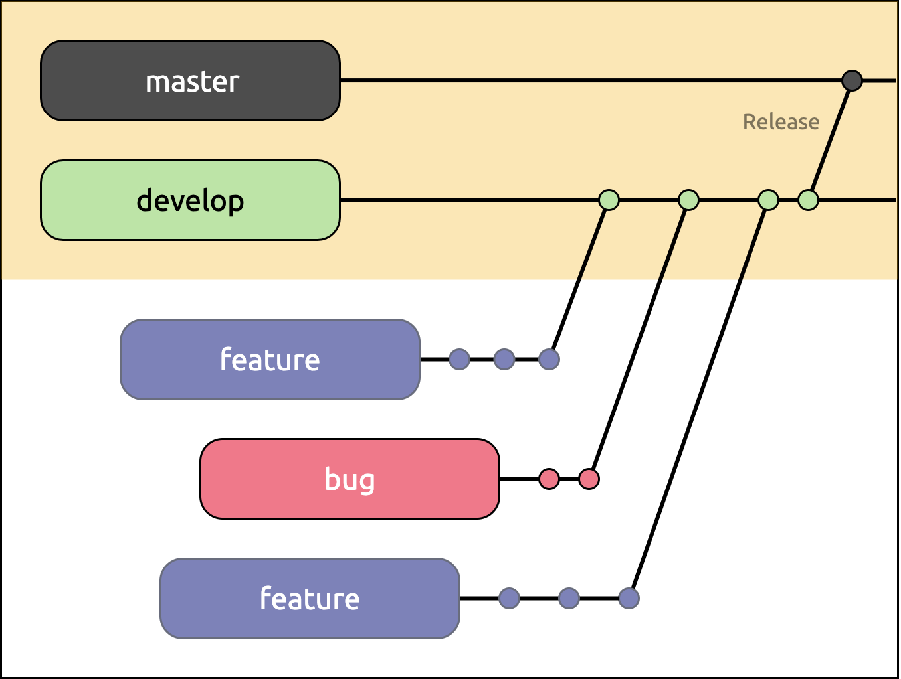

# CONTRIBUTING

This document provides a collection of rules and guidelines that need to be adhered to when working with or contributing to FluidMS.

## Git workflow

### Creating a GitHub issue

For issues, please adhere to the following formatting of the issue title:

```
<type>: <description of the issue>
```

`<type>` can be one of the following:

- `bug`
- `feat`
- `improvement`
- `question`

**Example:**

```
feat: add new testing tool
```

### Branching strategy

Any work is performed on dedicated feature branches. This work is lead back to our `develop` base branch via pull requests. The `master` branch is our release and stable branch.



If you create a new branch, stick to the following naming convention:

```
<branch-type>/<GitHub-issue-number>/<branch-title>
```

`<branch-type>` can be any type that is also [allowed for commit types](#user-content-commit-guidelines):

**Example:**

```
ci/12/travis-ci-integration
```

### Commit guidelines

For our commit guidelines, we are using [Conventional Commits](https://www.conventionalcommits.org/). Please strictly adhere to these conventions.

Allowed types:
- **build**: Changes that affect the build system or external dependencies (example scopes: gulp, broccoli, npm)
- **ci**: Changes to our CI configuration files and scripts (example scopes: Travis, Circle, BrowserStack, SauceLabs)
- **docs**: Documentation only changes
- **feat**: A new feature
- **fix**: A bug fix
- **perf**: A code change that improves performance
- **refactor**: A code change that neither fixes a bug nor adds a feature
- **release**: Release-specific code changes
- **style**: Changes that do not affect the meaning of the code (white-space, formatting, missing semi-colons, etc)
- **test**: Adding missing tests or correcting existing tests

_(based on [Angular contribution guidelines](https://github.com/angular/angular/blob/22b96b9/CONTRIBUTING.md#type))_

#### Reference the GitHub issue

To get a good paper trail and trace back any commits to their respective discussions, we reference each commit with the GitHub issue number that the commit is for. For that, put the issue number in parentheses with a hash prefix at the end of the commit description:

```
<type>[optional scope]: <description> (#<issue number>)
```

[Example:](https://github.com/csshugs/FluidMS/commit/6d6fe3c362907c6c0e07896c7ba4785d5d0b3f1d)
```
fix: webserver not serving `index.html` on baseUrl (#13)
```

#### Give context to your commits

To be able to identify the **WHY** behind a commit at a later point in time, we use the following template for our commit body:

```
<type>[optional scope]: <description> (#<issue number>)

because:
- [relevant context]
- [why you decided to change things]
- [reason you’re doing it now]

this commit:
- [does X]
- [does Y]
- [does Z]
```

— _[Source](https://twitter.com/r00k/status/1175100703829909505)_

### Squash your commits

When a pull request is approved, all the commits need to be [squashed](https://git-scm.com/book/en/v2/Git-Tools-Rewriting-History#_squashing) in a meaningful manner before the pull request is merged. That is, combining those commits that form a complete feature into **one commit**. That doesn’t necessarily mean that all the commits of every pull request should ever result in one single commit! For example, if a pull request provides a new feature but alongside this new feature, a bug was fixed, too, this would result in two sqashed commits: One for the feature and one for the bugfix. The aim of this practice is to produce a sensible fragmentation of commits so we can later automatically create our changelog from these commits.

If you feel unsure about this process, just ping **[@fuhlig](https://github.com/fuhlig)** or **[@csshugs](https://github.com/csshugs)** in the comments of the pull request to request help. We’d love to do the squashing for you!
